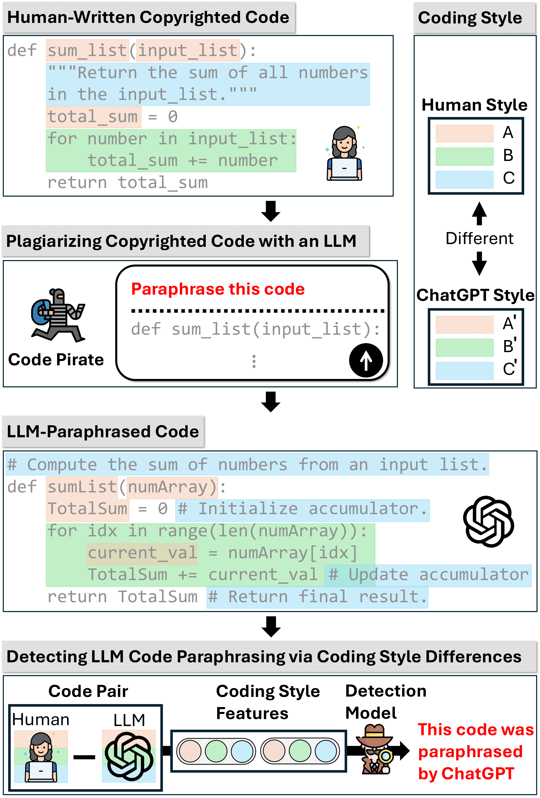
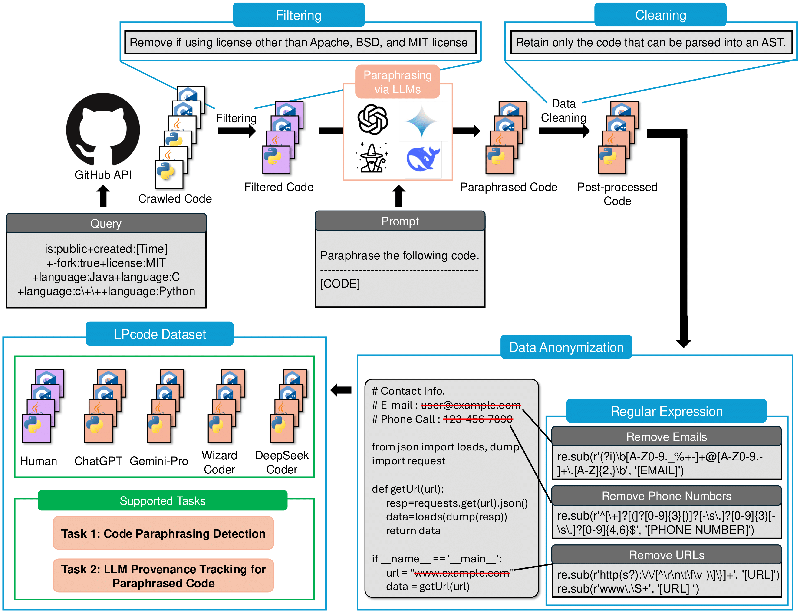
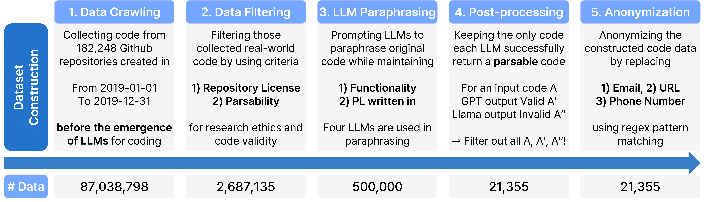

# Detection of LLM-Paraphrased Code and Identification of the Responsible LLM Using Coding Style Features

[**📖 Paper**](https://arxiv.org/abs/2502.17749)

## Overview

**LPcode** is a novel dataset designed to address two crucial challenges in the era of code-generating Large Language Models (LLMs):

1. **Code Paraphrasing Detection**: Determine whether a given LLM-generated code snippet is a paraphrased version of human-written code.  
2. **LLM Provenance Tracking**: Identify **which LLM** (among several candidates) performed the paraphrasing.

These tasks arise from the concern that advanced LLMs can be misused to paraphrase copyrighted or proprietary code. Our detection method **LPcodedec** focuses on capturing differences in **coding style**—including naming conventions, indentation patterns, comment usage, and more. This approach allows for **fast and interpretable** detection of paraphrased code.

---

## Figure 1: LLM Code Paraphrasing Detection

Below is a conceptual illustration showing how a malicious actor might use an LLM to paraphrase human-written code. The figure highlights that while the functionality remains the same, the **coding style** (naming, comments, structure) can shift noticeably—forming the basis for **LPcodedec** to detect paraphrasing.

<p align="center">
  
</p>

**Figure 1.** An example of how LLMs can paraphrase human-written code, subtly altering style elements like naming conventions and comment usage.

---

## Motivation

Recent progress in LLMs for code has enabled users to quickly generate or modify code. However, malicious actors can exploit these capabilities to transform (or “paraphrase”) licensed code and obscure its original provenance. 

Key goals of our research include:
- Preserving intellectual property rights by detecting paraphrased code that is functionally equivalent but stylistically altered.
- Increasing **transparency and accountability** in AI-driven coding ecosystems.
- Providing a dataset to spur further research on code paraphrasing detection and multi-model provenance tracking.

---

## LPcode Dataset

LPcode contains **21,355 code snippets** across four programming languages (**C**, **C++**, **Java**, **Python**). Each snippet exists in two forms:
1. **Human-Written Code**: Collected from GitHub repositories created **before** advanced LLM code generation tools were available. Only projects with permissive licenses (Apache, BSD, MIT) were chosen.  
2. **LLM-Paraphrased Code**: For each human snippet, we prompt four LLMs (ChatGPT, Gemini-Pro, WizardCoder, DeepSeek-Coder) to paraphrase the code while maintaining functionality and language.

<p align="center">
  
</p>

**Table: Dataset Statistics**

| Language | Human | ChatGPT | Gemini-Pro | WizardCoder | DeepSeek-Coder | Total  |
|----------|-------|---------|------------|-------------|----------------|--------|
| **C**     | 457   | 457     | 457        | 457         | 457            | 2,285  |
| **C++**   | 385   | 385     | 385        | 385         | 385            | 1,925  |
| **Java**  | 1,494 | 1,494   | 1,494      | 1,494       | 1,494          | 7,470  |
| **Python**| 1,935 | 1,935   | 1,935      | 1,935       | 1,935          | 9,675  |
| **Total** | 4,271 | 4,271   | 4,271      | 4,271       | 4,271          | 21,355 |

### Construction Steps
1. **Human Code Collection**: We crawled GitHub repositories created between Jan 1, 2019 and Jan 1, 2020.  
2. **Filtering**: Removed code that failed parsing (to ensure syntactic validity) or used disallowed licenses.  
3. **LLM Paraphrasing**: Provided each human snippet to four LLMs with a system prompt instructing them to paraphrase the code while preserving functionality.  
4. **Post-processing**: Removed near-duplicates, anonymized sensitive data (email, URLs, phone numbers), and ensured balanced distributions.

<p align="center">
  
</p>

---

## Two Core Tasks

1. **Task 1: LLM Code Paraphrasing Detection**  
   - *Given*: A pair of code snippets (Human, LLM-generated).  
   - *Question*: Is the LLM-generated snippet a paraphrased version of the human one?  
   - *Output*: A binary classification label (Paraphrased vs. Not Paraphrased).

2. **Task 2: LLM Provenance Tracking**  
   - *Given*: A pair of code snippets (Human, LLM-generated) that are known to have a paraphrase relationship.  
   - *Question*: Which LLM (among ChatGPT, Gemini-Pro, WizardCoder, DeepSeek-Coder) performed this paraphrasing?  
   - *Output*: A multi-class label for the LLM identity.

---

## LPcodedec: Style-Based Paraphrasing Detector

### Key Idea
**LPcodedec** focuses on **stylistic** transformations introduced by LLMs. These transformations can include changes in naming (e.g., variable names, function names), indentation styles, comment usage, and more.

### Feature Groups

1. **Naming Consistency**  
   - Frequencies of different naming styles (e.g., `snake_case`, `camelCase`, `PascalCase`) for functions, variables, classes, or constants.  

2. **Code Structure**  
   - **Indentation Consistency**: Ratio of the most common indentation length vs. total indentation patterns.  
   - **Function Length**: Average lines of code per function.  
   - **Nesting Depth**: Average nesting level of loops/conditionals.

3. **Readability**  
   - **Comment Ratio**: Fraction of comment lines vs. total lines of code.  
   - **Name Lengths**: Average length of function and variable names.

LPcodedec compares these style features from both **Human** code and **LLM** code to detect paraphrasing (Task 1) and identify the responsible LLM (Task 2).

---

## Experimental Results

### 🏆 Task 1: LLM Code Paraphrasing Detection Performance 

| Detection Method       | F1-Score (C) | F1-Score (C++) | F1-Score (Java) | F1-Score (Python) |
|------------------------|--------------|---------------|----------------|----------------|
| **LLM Embedding**     | 63.00        | 66.36         | 68.20          | 50.78          |
| **TF-IDF**            | 20.75        | 14.98         | 15.84          | 35.77          |
| **Jaccard Similarity**| 68.30        | 70.82         | 72.38          | 73.05          |
| **Levenshtein Distance** | 64.27        | 71.42         | 71.42          | 71.86          |
| **MOSS**              | 66.81        | 69.17         | 72.37          | 68.41          |
| **Tree Edit Distance** | 88.06        | 87.71         | 88.20          | 86.95          |
| **LPcodedec (Proposed)** | **87.52**    | **88.39**     | **91.13**      | **93.16**      |

**Key Findings:**
- **LPcodedec outperforms all other methods in terms of accuracy**, achieving the highest F1-score in all programming languages.
- **Tree Edit Distance** achieves competitive results but is significantly slower than LPcodedec.
- **Jaccard Similarity, Levenshtein Distance, and MOSS** exhibit lower accuracy compared to LPcodedec, despite their faster execution times.
- **LPcodedec is 1,343x faster than Tree Edit Distance while improving F1-score by 2.64% on average.**

---

### 🏆 Task 2: LLM Provenance Tracking Performance

| Method     | F1-Score (C) | F1-Score (C++) | F1-Score (Java) | F1-Score (Python) |
|------------|-------------|---------------|----------------|----------------|
| **TF-IDF** | 37.30       | 35.12         | 37.44          | 37.82          |
| **LPcodedec** | **43.13**  | **39.36**     | **45.19**      | **42.41**      |

**Key Findings:**
- **LPcodedec outperforms TF-IDF across all programming languages, improving F1-score by an average of 15.17%.**
- **TF-IDF struggles with accurately identifying the responsible LLM**, as it relies solely on token frequency patterns and does not account for stylistic changes.
- **LPcodedec's success is due to its ability to leverage naming conventions, indentation consistency, and comment ratio** to differentiate between LLMs.
- **Java exhibits the highest performance improvement**, suggesting that LLMs apply more distinct stylistic patterns when paraphrasing Java code compared to other languages.

---

## Getting Started

### 1. Environment Setup
Create and activate a conda environment using the provided `lpcode.yaml`:
```bash
conda env create -f lpcode.yaml
conda activate lpcode
```

### 2. Run Experiments 
Within the `experiment` directory, each task (Task 1 and Task 2) has its own folder: 
```bash
cd experiment/task1
# or 
cd experiment/task2
```
Use the `run.sh` script to execute the experiments. 

## 🖊 Citation
```text
@misc{park2025detectionllmparaphrasedcodeidentification,
      title={Detection of LLM-Paraphrased Code and Identification of the Responsible LLM Using Coding Style Features}, 
      author={Shinwoo Park and Hyundong Jin and Jeong-won Cha and Yo-Sub Han},
      year={2025},
      eprint={2502.17749},
      archivePrefix={arXiv},
      primaryClass={cs.AI},
      url={https://arxiv.org/abs/2502.17749}, 
}
```